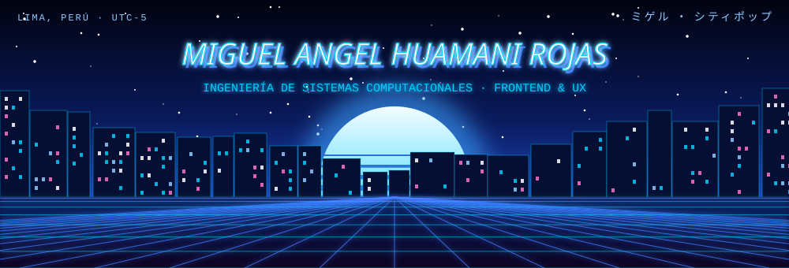
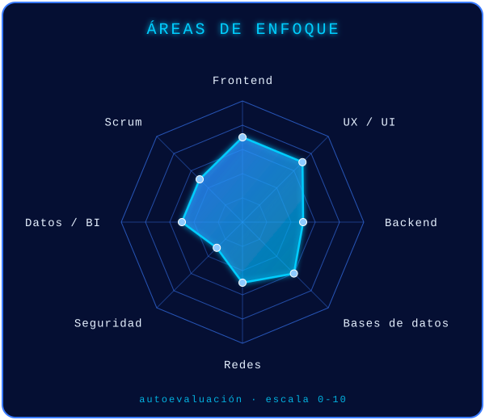
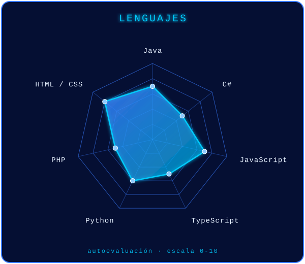

---

## `$ whoami`

> 🌴 *vibe: city pop · noche en Lima · compilando…*

---

## `$ cat stack.yaml`

**Lenguajes**

**Frontend y Backend**

**Bases de datos y servidores**

**Redes y seguridad**

-050f33?style=for-the-badge&logo=kalilinux&logoColor=3a7bff)

**Herramientas**

---

## `$ radar --scan`

---

## `$ git stats`

---

## `$ ls ~/proyectos`

| Proyecto | Descripción | Tecnología |
|---|---|---|
| [**ToyCommerce**](https://github.com/MiguelAHR/ToyCommerce) | Tienda web MiniKids sobre WordPress | `PHP` `WordPress` |
| [**Agente117_Protocolo_Escape**](https://github.com/MiguelAHR/Agente117_Protocolo_Escape) | Videojuego 2D *(título final por confirmar)* | `C#` `Unity` |
| [**Proyecto-clasificador-alimentos**](https://github.com/MiguelAHR/Proyecto-clasificador-alimentos) | Clasificador de alimentos con IA | `Python` |
| [**ColegioGestion**](https://github.com/MiguelAHR/ColegioGestion) | Sistema de gestión escolar | `Java` |
| [**DonacionesPeru**](https://github.com/MiguelAHR/DonacionesPeru) | Plataforma de donaciones | `Java` |
| [**tiendaAguilu**](https://github.com/MiguelAHR/tiendaAguilu) | Tienda web | `HTML` |
| [**dataset-gatos-perros**](https://github.com/MiguelAHR/dataset-gatos-perros) | Dataset de gatos y perros para IA | `Python` |
| [**appMovil**](https://github.com/bryan7hc/appMovil) | Colaborador en repo de [@bryan7hc](https://github.com/bryan7hc) (40 de 60 commits) · propósito por confirmar | `Java` |

---

## `$ cat certificaciones.log`

- 🔹 **Scrum Fundamentals Certified (SFC)** · SCRUMstudy (VMEdu, Inc.) · 2024
- 🔹 **Big Data Analyst** (certificación por competencias) · Universidad Privada del Norte · 2024
- 🔹 **CCNA: Introducción a las redes** · Cisco Networking Academy (vía UPN) · 2026
- 🔹 **Get Connected** · Cisco Networking Academy · 2024
- 🔹 **IA Heroes Live** (asistencia, 8 h) · Learning Heroes · 2025
- 🔹 **Curso intensivo de Oratoria I** · EduClase / Taller de Comunicación y Oratoria · 2022

---

## `$ connect --contact`

Hecho con 💖 y synthwave · Lima, Perú

